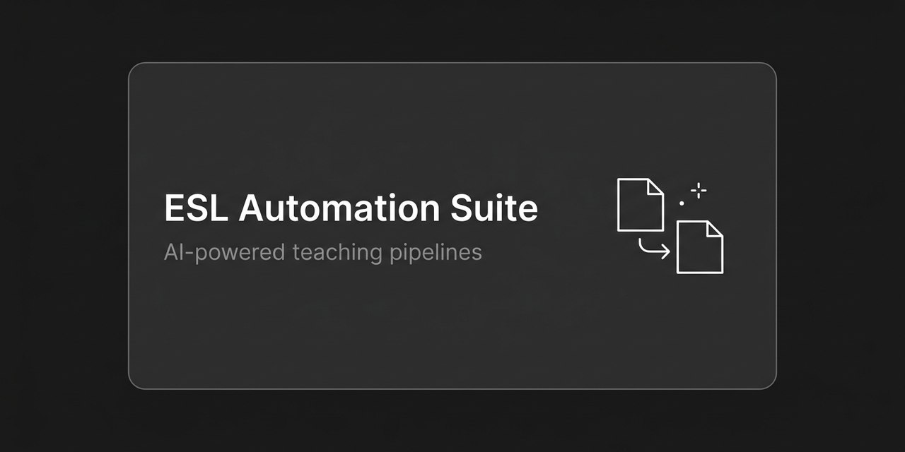

# 🎓 ESL Automation Suite: AI teaching pipelines that save hours every week

Real-world AI automations for a private ESL teaching practice. Each pipeline
turns raw material (a video, a voice note, an article) into a finished
teaching artifact in minutes instead of hours. No generic templates, every
output is personalized to the student and the level.

  

## Pipelines

| Automation | Input → Output | Docs |
|---|---|---|
| **Lesson Guide Generator** | YouTube URL / transcript → full teacher's guide: vocabulary, 4 exercises + 2 bonus, discussion | [docs/homework-generator.md](docs/homework-generator.md) |
| **Student Voice Log** | Voice note about a student → structured entry in a Notion tracker | [docs/student-voice-log.md](docs/student-voice-log.md) |
| **TV-Episode Homework** | Episode script → recap + 4+2 exercises, ≤15-minute homework | [docs/tv-episode-homework.md](docs/tv-episode-homework.md) |
| **C1 Exercise Builder** | Raw topic material → personalized C1 writing exercise with data visuals | [docs/c1-exercise-builder.md](docs/c1-exercise-builder.md) |
| **ESL Minecraft Plugins** | Custom PaperMC plugins: AI-scored chat money, earnings-driven level-ups, vocab quiz, daily tasks | [chat2earn](https://github.com/HailorLEM/chat2earn) · [englishprogression](https://github.com/HailorLEM/englishprogression) · [vocabquiz](https://github.com/HailorLEM/vocabquiz) · [dailyenglish](https://github.com/HailorLEM/dailyenglish) |

## Example outputs

Real artifacts produced by these pipelines:

- [Lesson Guide: The Dangers of Copying Successful People (B2)](examples/lesson-guide-dangers-of-copying-successful-people-B2.html)
- [Teacher Kit: Small Talk Course (B1)](examples/teacher-kit-small-talk-course-B1.html)
- [Live example: C1 Describing Visual Data exercise](https://hailorlem.github.io/taimas-visual-data)

## How it works

The pipelines are prompt-driven automations (built on the Hermes agent):
extract the raw material first, generate the teaching artifact second. Every
guide follows a strict structure: level-appropriate language, vocabulary
from the source, a fixed exercise layout, student-facing copy. The result is
ready to paste into Edvibe or send to the student.

## License

[MIT](LICENSE)
